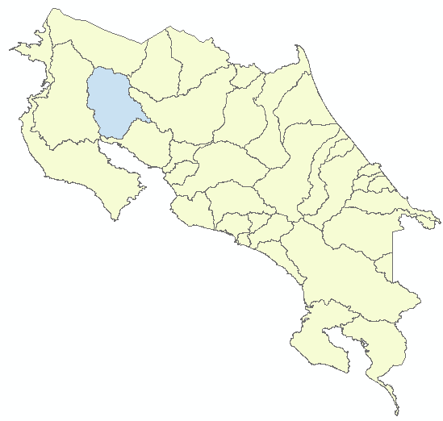

# TP2-GEE
## Objetivos
Familiarícese con los datos satelitales multiespectrales **Landsat 8**  

Examinar diferentes combinaciones de **colores y bandas espectrales** para comprender y extraer la tierra
### Instrucciones : Desarrolle un código en GEE que cumpla con las siguientes características
1.	Seleccione una ‘cuenca’ del shapefile de cuencas
2.	Filtre imágenes [Landsat 8 TOA](https://explorer.earthengine.google.com/#detail/LANDSAT%2FLC08%2FC01%2FT1_TOA), de tal manera que seleccione para el año 2019, la imagen con menor nubosidad
3.	Realice combinaciones de bandas usando las imágenes Landsat 8
#### Elección de cuenca 

