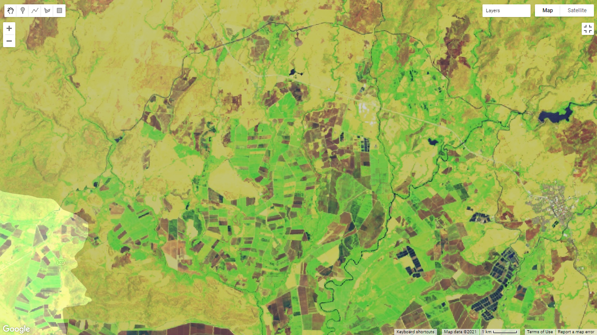

## Objetivos
Familiarícese con los datos satelitales multiespectrales **Landsat 8**  

Examinar diferentes combinaciones de **colores y bandas espectrales** para comprender y extraer la tierra
### Instrucciones : Desarrolle un código en GEE que cumpla con las siguientes características
1.	Seleccione una ‘cuenca’ del shapefile de cuencas
2.	Filtre imágenes [Landsat 8 TOA](https://explorer.earthengine.google.com/#detail/LANDSAT%2FLC08%2FC01%2FT1_TOA), de tal manera que seleccione para el año 2019, la imagen con menor nubosidad
3.	Realice combinaciones de bandas usando las imágenes Landsat 8
#### Elección de cuenca 

#### Combinación de bandas

[Código GEE](https://code.earthengine.google.com/e4d50d0954cac6e04bc3e50cef0b661e)

Analice los resultados
- Color Natural **B4,B3,B2**. En este caso se aprecia la superficie que combina tres bandas del espectro visible; rojo, verde y azul respectivamente.Se obtiene con ello una superficie tal como la percibe el ojo humano.
- Infrarrojo **B5,B4,B3**. Áreas de bosque con mayor vegetación poseen alta reflectancia con color rojo, en zonas con menor vegetación la intensidad del rojo disminuye e incluso llegando a ser nula.Se pueden distinguir cuerpos de agua en una tonalidad oscura.
- Agrícola **B6,B5,B2** Las zonas de agricultura reflejan un verde brillante, se aprecian suelos descubiertos y con un color amarillo escasa vegetación.
- Urbano **B7,B6,B4** En este caso es fundamental identificar zonas de reflectancia con colores grises o morados en referencia a lo urbano.De igual forma permite apreciar cuerpos de agua.
- Uso de suelo/cuerpos de agua **B5,B6,B4** Se pueden distinguir fácilmente los cuerpos de agua con un azul oscuro, zonas con alta vegetación amarillo y suelos descubiertos preparados para la siembra.

##### Conteste las siguientes preguntas
1	¿Cuáles son las ventajas de las características multiespectrales de los datos de teledetección digital?

>*Estos sistemas tienen la capacidad de detectar y cuantificar las señales, por ejemplo, de reflectancia que se presenta en la superficie terrestre o en la atmósfera. Jensen (como se citó en Weng ,2012) señala que existirá un mayor éxito en la recopilación de datos cuando se contemplen a detalle aspectos como la resolución espacial, espectral, radiométrica y temporal.Los sensores satelitales poseen la ventaja de registrar y detectar una gama mucho más amplia de radiación electromagnética. Con base en la longitud de onda se puede determinar una clase de respuesta espectral de cada objeto en la superficie. Generando la posibilidad de distinguir cuerpos de agua, vegetación, uso de suelo, cobertura o materiales con respecto al rango del espectro electromagnético detectado. Un sistema de teledetección digital tiene gran flexibilidad ya que puede detectar radiación electromagnética en las regiones IR visible y cercana, o extenderse a las regiones IR media y térmica*
(Weng ,2012).

2	¿Qué fecha tiene la imagen que corresponde a la que menor nubosidad?
> Primeramente se probó con los meses de enero-febrero del 2019, con ese rango se presentaba gran cantidad de nubes en el área de la cuenca, posteriormente se amplió el rango hasta el mes de marzo y con ello se logra visualizar la zona de interés con muy poca nubosidad 
 
3	¿Qué combinaciones espectrales de bandas y colores considera útil para comprender las características del paisaje de su interés?
> Esto dependerá de la cobertura que se desea analizar o darle mayor énfasis y así obtener mayor reflexión de los elementos, por ejemplo, en este caso la Cuenca Bebedero presenta zonas con gran cantidad de pastizales por su importancia en la actividad ganadera de la región, de igual manera sobresalen bandas para corroborar la cantidad de vegetación sana o suelo descubierto pues en la cuenca tambieén se realiza actividad agrícola. Las bandas para identificar lo urbano en este caso se deben de apreciar con gran detenimiento pues al tratarse de zonas mayormente rurales se dificulta un poco percibir los paisajes con mayor cantidad de infraestructura y densidad. Fundamental la combinación para apreciar los cuerpos de agua con mayor detalle tomando en cuenta que estas fuentes hídricas son determinantes en las dinámicas económicas, ambientales y sociales de la región. 
